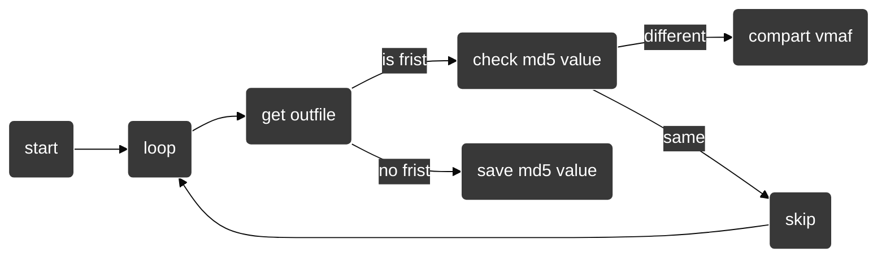

[toc]

## 环境

- `bash` shell解释器

- `xcode\xcode-build`脚本编译项目

- `ios-deploy`用作操作手机的文件系统、以及启动App

  - github : `https://github.com/ios-control/ios-deploy`

- `idevicesyslog`用作调取App日志

  - github : `https://github.com/libimobiledevice/libimobiledevice`

- `ffmpeg/ffplayer/ffprobe`视频编解码

上述环境需要自行安装

## 脚本结构

该脚本是面向`VideoEncode`编写的,一旦IOS项目中的关键变量更换名称，同时脚本也要进行手动跟进,比如IOS项目中有一个“free zone区域”注释代码那块，这个flag是用作给脚本添加参数值的标记

- user config区域的变量为一些需要经常修改的值

```bash
device_id="00008110-000458D63AB8801E" #iphone13(no use wifi connect)
#这里需要指定ios设备的id值，是为了避免多个有限、无线设备同时在线的冲突，这里屏蔽的wifi设备
codec_type="h265" 
#编码的类型,修改会自动找到IOS项目的"int IS_H264_OR_H265 ="变量进行同步
tar_dir="${HOME}/Desktop/IOSVideoEncodeDemo"
#IOS项目的本地路径，需要自行修改
```

- default config区域一般不用修改

```bash
src_same_frames="${src%.*}_same_frames"
#因为IOS项目编码后会导致丢帧 比如frames:578--encode-->frames:570,所以这里对IOS项目中输出文件和输入文件做一个统一帧数的操作
is_info_ffmpeg="-loglevel quiet"
#ffmpeg运行的日志消息过多。 当需要调试错误时可以关闭该变量
```

- dynamic init区域

```bash
docker_container_id
#docker容器的id
```

##### 历史遗留问题

在我拿到IOS项目时，该项目设计就有许多不完善的地方，因为画质对比工具`wztool`是一个`linux`可执行文件，在原IOS项目输出文件是手动拖到`linux虚拟机`中然后再 进行操作，再我改造该项目变为自动化时，索性加上了一个`docker`方便自动化，但是最近找到了一个新方案替代

在对`ffmpeg`添加`vmaf`扩展后(目前最新版已经集成了)即可执行该命令进行画质对比

```bash
ffmpeg -y -i src_same_frames.mp4 -i dst.mp4 -lavfi libvmaf=log
_path=output.xml -f null -
```

这条命令还没有批量测试过，所以该方案暂时保留


## 使用

- 脚本使用时建议为独立目录，因为每次执行脚本都会自动清空当前的运行过程中产生临时文件

- 使用前需要打开docker容器

- 需要有一个参数列表配置文件`config.data` （就是待测试的参数），可通过`generate_foot_arg.sh`生成

  

`config.data`文件结构

```less
reset
kVTCompressionPropertyKey_AllowFrameReordering:kCFBooleanTrue:add
kVTCompressionPropertyKey_AllowFrameReordering:kCFBooleanFalse:add
kVTCompressionPropertyKey_AllowFrameReordering:(__bridge CFTypeRef)@(fps):add
kVTCompressionPropertyKey_AllowFrameReordering:(__bridge CFTypeRef)@(100):add
kVTCompressionPropertyKey_AllowFrameReordering:(__bridge CFTypeRef)@(1000):add
reset
kVTCompressionPropertyKey_AllowOpenGOP:kCFBooleanTrue:add
kVTCompressionPropertyKey_AllowOpenGOP:kCFBooleanFalse:add
kVTCompressionPropertyKey_AllowOpenGOP:(__bridge CFTypeRef)@(fps):add
kVTCompressionPropertyKey_AllowOpenGOP:(__bridge CFTypeRef)@(100):add
kVTCompressionPropertyKey_AllowOpenGOP:(__bridge CFTypeRef)@(1000):add
```

`reset` 表示会恢复到上一个版本 ： 这里的意思是要测试`kVTCompressionPropertyKey_AllowFrameReordering`参数的值，待测试完后使用`reset`回到上一个版本，再开始下一个参数测试

`参数末尾的add` 表示添加这个参数，当存在该参数会直接修改值，反之则在“=free zone="区域添加


`foot.sh`会提示以下信息

```bash
$ ./foot.sh                                    

Target file -> /Users/user/Desktop/IOSVideoEncodeDemo/VideoEncode/encode/EncodeH264.m
example:

./foot.sh start
./foot.sh upload
./foot.sh annotation [code_line] [on\off]
./foot.sh justlaunch
./foot.sh dump
./foot.sh clean
```

`Target file` 会指向`EncodeH264.m`的绝对路径，这里可以查看是否路径错误

option:

- **start** : 使用前需要有对应的参数列表文件`config.data`
- **upload** : 在需要使用其他源视频时，将视频转移到当前目录并命名为`src.mp4`
- **annotation** ： 按照代码行数注释`EncodeH264.m`文件的代码
- **dump** : 表示拉取手机解码完成后的`video.h264\h265`文件，并进行画质对比
- **clean** : 清理脚本运行过程中的中间文件

## vmaf对比模式

在面对上百个参数列表时，如果一个个对比画质会导致非常耗时，比如某个参数的`kCFBooleanTrue`值和`kCFBooleanFalse`值使编码文件完全一致，那么就不需要进行一个画质对象（这个过程非常耗时，与帧数成正比）

##### foot.sh脚本的模式是：

在首次执行脚本时，会记录第一个输出文件的`md5`值，在之后的每次dump完输出文件后与上个`md5`值进行对比如果一致则表明他们的编码画质一样，从而不需要进行画质对比操作。反之则进行画质对比，同时并进行覆盖上一个文件的`md5`值





