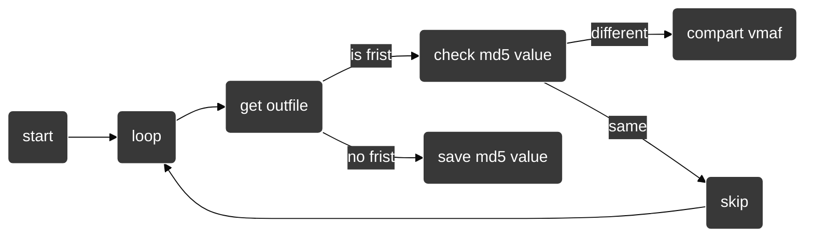

[toc]

## 环境

- `bash` shell解释器

- `xcode\xcode-build`脚本编译项目

- `ios-deploy`用作操作手机的文件系统、以及启动App
  - github : [https://github.com/ios-control/ios-deploy](https://github.com/ios-control/ios-deploy)
  - mac:`brew install ios-deploy`
  
- `idevicesyslog`用作调取App日志
  - github : [https://github.com/libimobiledevice/libimobiledevice](https://github.com/libimobiledevice/libimobiledevice)
  - mac: `brew install libimobiledevice`
  
- `ffmpeg/ffplayer/ffprobe`视频编解码

上述环境需要自行安装

## 脚本结构

该脚本是面向`VideoEncode`编写的,一旦IOS项目中的关键变量更换名称，同时脚本也要进行手动跟进,比如IOS项目中有一个“free zone区域”注释代码那块，这个flag是用作给脚本添加参数值的标记

- user config区域的变量为一些需要经常修改的值

```bash
device_id="00008110-000458D63AB8801E" #iphone13(no use wifi connect)
#这里需要指定ios设备的id值，是为了避免多个有限、无线设备同时在线的冲突，这里屏蔽的wifi设备
codec_type="h265" 
#编码的类型,修改会自动找到IOS项目的"int IS_H264_OR_H265 ="变量进行同步
tar_dir="${HOME}/Desktop/IOSVideoEncodeDemo"
#IOS项目的本地路径，需要自行修改
compare_patterns="wztool" #example -> libvmaf|wztool
#这个参数表示使用wztool进行对比vmaf，那么就需要使用linux系统，那就是需要一个docker
docker_container_name="centos/wztool"
#如果上面指定了wztool模式那么就需要指定装有wztool工具的docker容器名称
```

- default config区域一般不用修改

```bash
src_same_frames="${src%.*}_same_frames"
#因为IOS项目编码后会导致丢帧 比如frames:578--encode-->frames:570,所以这里对IOS项目中输出文件和输入文件做一个统一帧数的操作
is_info_ffmpeg="-loglevel quiet"
#ffmpeg运行的日志消息过多。 当需要调试错误时可以关闭该变量

#大多数是不需要进行修改的参数
```

- dynamic init区域

```bash
#这里的区域是用来动态初始化的不用管
```

然后主体代码部分都是有注释的，具体分为了以下几大板块:

1. `control level` 用于控制脚本运行次数，比如便利参数列表进行循环操作，又比如单次运行脚本，测试单个视频参数
2. `kernel process level` 代码的核心层，脚本进入主体部分就会调用各种操作来执行对应的自动化操作
3. `data level` 用于操作ios项目的文件，比如自动获取到视频信息后，然后对源代码文件的参数值（宽高、帧数、编码类型、时长等等）进行一个值替换
4. `environment check level` 用于检查当前脚本运行环境是否存在问题，处在问题时抛出对应问题异常
5. `code extract level` 用于封装函数，防止代码的重复率高，减小代码体积
6. `util level` 用于各个功能函数的分块，其子模块都可以用于单独运行


## 使用

- 运行前需要指定源视频文件，并命名为`src.mp4`

- 脚本使用时建议为独立目录，因为每次执行脚本都会自动清空当前的运行过程中产生临时文件

- 本脚本中对比模式有两种`wztool`、`libvmaf`但是实际测试的话`libvmaf`没进行一次对比的时长要比`wztool`慢，具体可以下面**wztool、libvmaf对比测试**章节

- 为了易于环境搭建，脚本默认使用`libvmaf`来获取`vmaf`，如需使用`wztool`需要使用`docker`进行搭建对应的环境

- 如果使用脚本选项`start`进行遍历参数文件操作的话，需要有一个参数列表配置文件`config.data` （就是待测试的参数），可通过`generate_foot_arg.sh`生成。如果使用的是`upload`参数则需要的是`source`文件夹里面存放着需要遍历的视频文件

  

### 用于`start`选项的`config.data`文件结构

```less
reset
kVTCompressionPropertyKey_AllowFrameReordering:kCFBooleanTrue:add
kVTCompressionPropertyKey_AllowFrameReordering:kCFBooleanFalse:add
kVTCompressionPropertyKey_AllowFrameReordering:(__bridge CFTypeRef)@(fps):add
kVTCompressionPropertyKey_AllowFrameReordering:(__bridge CFTypeRef)@(100):add
kVTCompressionPropertyKey_AllowFrameReordering:(__bridge CFTypeRef)@(1000):add
reset
kVTCompressionPropertyKey_AllowOpenGOP:kCFBooleanTrue:add
kVTCompressionPropertyKey_AllowOpenGOP:kCFBooleanFalse:add
kVTCompressionPropertyKey_AllowOpenGOP:(__bridge CFTypeRef)@(fps):add
kVTCompressionPropertyKey_AllowOpenGOP:(__bridge CFTypeRef)@(100):add
kVTCompressionPropertyKey_AllowOpenGOP:(__bridge CFTypeRef)@(1000):add
```

`reset` 表示会恢复到上一个版本 ： 这里的意思是要测试`kVTCompressionPropertyKey_AllowFrameReordering`参数的值，待测试完后使用`reset`回到上一个版本，再开始下一个参数测试

`参数末尾的add` 表示添加这个参数，当存在该参数会直接修改值，反之则在“=free zone="区域添加


### 用于`upload loop`选项的`source`目录结构

```less
$ ls source/                                   
人物视频1.MP4_done       人物视频23.MP4
人物视频13.MP4_done      人物视频25.MP4
人物视频16.MP4_done      人物视频3.MP4
人物视频17.MP4_done      人物视频4.MP4
人物视频18.MP4_done      .......
```

`foot.sh`会提示以下信息

```bash
$ ./foot.sh                                    

Target file -> /Users/user/Desktop/FFmpeg_iOS/FFmpeg_iOS/encode/EncodeH264.m
example:

./foot.sh start > /dev/null
./foot.sh upload > /dev/null
./foot.sh upload loop > /dev/null
./foot.sh annotation [code_line] [on\off]
./foot.sh justlaunch > /dev/null
./foot.sh dump > /dev/null
./foot.sh clean
./foot.sh format       ###format compare_result_file data and calculate the average
```

`Target file` 会指向`EncodeH264.m`的绝对路径，这里可以查看是否路径错误

option:

- **start** : 使用前需要有对应的参数列表文件`config.data`
- **upload** : 在需要使用其他源视频时，将视频转移到当前目录并命名为`src.mp4`
- **annotation** ： 按照代码行数注释`EncodeH264.m`文件的代码
- **dump** : 表示拉取手机解码完成后的`video.h264\h265`文件，并进行画质对比
- **clean** : 清理脚本运行过程中的中间文件
- **format** : 将运行日志文件格式化，并且计算平均值

## vmaf对比模式

在面对上百个参数列表时，如果一个个对比画质会导致非常耗时，比如某个参数的`kCFBooleanTrue`值和`kCFBooleanFalse`值使编码文件完全一致，那么就不需要进行一个画质对象（这个过程非常耗时，与帧数成正比）


在首次执行`foot.sh`脚本时，会记录第一个输出文件的`md5`值，在之后的每次dump完输出文件后与上个`md5`值进行对比如果一致则表明他们的编码画质一样，从而不需要进行画质对比操作。反之则进行画质对比，同时并进行覆盖上一个文件的`md5`值





## wztool、libvmaf对比测试

对比帧数`frame = 567`


|  f(x)  | psnr  |  ssim  |  vmaf   | total time |
| :----: | :---: | :----: | :-----: | :--------: |
| wztool | 46.93 | 0.9916 | 93.9954 |   54.01    |
| libvmf | 48.42 | 0.9993 | 96.0297 |   93.25    |

### wztool:

```bash
PSNR=46.93 [y_psnr=46.61 u_psnr=46.68 v_psnr=48.95]  min_psnr=40.54
SSIM=0.9916 [y_ssim=0.9916 u_ssim=0.9912 v_ssim=0.9922]  min_ssim=0.9714
Total time=47.360 sec
vmaf:93.9954
________________________________________________________
Executed in   54.01 secs      fish           external
   usr time  609.88 millis  105.00 micros  609.78 millis
   sys time  514.57 millis  871.00 micros  513.70 millis
```

### ffmpeg-vmaf:

```bash
    "psnr": {
      "min": 25.859386,
      "max": 49.654207,
      "mean": 48.424292,
      "harmonic_mean": 48.362034
    },
    "ssim": {
      "min": 0.930866,
      "max": 0.999823,
      "mean": 0.999340,
      "harmonic_mean": 0.999335
    },
    "vmaf": {
      "min": 26.696212,
      "max": 99.988200,
      "mean": 96.029725,
      "harmonic_mean": 95.600184
    }
________________________________________________________
Executed in   93.25 secs    fish           external
   usr time  104.72 secs    0.19 millis  104.72 secs
   sys time    1.41 secs    1.45 millis    1.41 secs
```

可以看到`wztool`花费时间`54.01 s` ，而`libvmaf`花费时间`93.25 secs`
